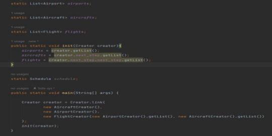

**Assignment 2**

**Design Pattern Implementation** 

Group 27 Members- 

Yash Pathak – 2022201026 Gaurav Khapekar – 2022201055 Vivek Kirpan – 2022201071 Adarsh – 2022201081  

Prasad Kawade - 2022202006 

Design Patterns can be a very key part of software solutions that we use to solve system creation and extension related problems.  

Patterns are a toolkit of solutions to common problems in software design. They define a common language that helps your team communicate more efficiently. 

Design patterns differ by their complexity, level of detail and scale of applicability. In addition, they can be categorized by their intent and divided into three groups. 

1. Creational Patterns - Patterns that are related to object creation. Example: Singleton Pattern.  
1. Structural Patterns - Patterns related to the structure of these objects and classes. Example: Façade Pattern.  
1. Behavioural Patterns - Patterns that are related to algorithms and inner-working of classes. Example: Observer Pattern. 

We have chosen design patterns and implemented them to enhance this system. This also includes fixing existing inextensible code.  

Following are the design patterns implemented: 

1. Factory (Creational Pattern)  
1. Observer (Behavioural Pattern) 
1. Adapter (Structural Pattern)  
1. Strategy (Behavioural Pattern)  
1. Builder (Creational Pattern) 
1. Composite (Behavioural Pattern)  
1. Command (Behavioural Pattern)  
1. Chain of Responsibility (Behavioural Pattern) 
1. Factory (Creational Pattern) – 
- **Factory Method** is a creational design pattern that provides an interface for creating objects in a superclass, but allows subclasses to alter the type of objects that will be created. 
- The Factory Method separates product construction code from the code that actually uses the product. Therefore it’s easier to extend the product construction code independently from the rest of the code. 
- Following is the factory pattern implementation: 

- **Task 1:** Apply Factory Pattern to **Plane** 
- Following is the implementation**:** 

We have created **PlaneFactory** interface and implemented in **HelicopterFactory** Class, **PassengerDroneFactory** Class and **PassengerPlaneFactory** Class. These factories will create the object based on the model number passed to them. 

With implementation of Factory pattern, we can easily add or remove features from the actual product without making changes in the product classes. (Analogous to an actual factory) 

**Fig. PlaneFactory Class**

**Fig. HelicoptorFactory Class** 

**Fig. PassengerDroneFactory Class** 

**Fig. PassengerPlaneFactory Class**

- **Task 2:** Apply Factory Pattern to **any other similar issue** 
- We have applied Factory method to **Payment.** 
- Following is the implementation**:** 

Similar to what we implemented above, we have added Factory pattern to Payment class.  

We are creating Payment objects and any new details in Payment can be added in PaymentFactory while creating. 

Please note: A common method in the interface could’ve been added if we take the Card details as input from User (runtime) or from some static constant data structure. 

As the params for *createPayment*() is different, no method in the interface. 

**Fig. PaymentFactory Class**

**Fig. PaypalFactory Class**

**Fig. CreditCardFactory Class**

2. Observer (Behavioural Pattern) - 
- **Observer** is a behavioural design pattern that lets you define a subscription mechanism to notify multiple objects about any events that happen to the object they’re observing. 
- We have applied the Observer Pattern in the **Passenger** and **ScheduledFlight** classes of the project. The idea is to notify the passengers about their scheduled flight. To do so, we have created an interface FlightObserver which has method *notify*(). 
- Whenever, a Flight gets Scheduled the method *notifyPassengers()* is called from the class which calls the notify() method of each passengers through the interface FlightObserver. 

**Fig. FlightObserver Interface**

- The Passenger class implements the interface FlightObserver and has the method notify() which when invoked prints the message to the user about the scheduled flight. 

**Fig. Passenger Class**

3. Adapter (Structural Pattern) - 
- Adapter is a structural design pattern that allows objects with incompatible interfaces to collaborate. 
- This is a special object that converts the interface of one object so that another object can understand it. An adapter wraps one of the objects to hide the complexity of conversion happening behind the scenes.  
- Adapters can not only convert data into various formats but can also help objects with different interfaces collaborate. 
- Following changes have been done to implement Adaptor Pattern:** 

**Fig. PaypalDao Class**

- Adapter pattern can be applied in **Paypal** Payment method by creating a **PaypalDao** Class which will handle the data processing of the Paypal Class. 
- **PaypalDao** works like DAO (Persistence Layer) where it works as an Adaptor and helps communicating with the Database (any type).** 
- Here, we are just using a Hash Map to store the Paypal credentials.** 
- By creating **PaypalDao**, we have resolved the issue of the storage support of any kind. We just need to add functions in DAO to communicate with the different DBs we use (i.e., create new adaptors).** 
- This can be done for all the various entities in the application where storage is required.** 
4. Builder (Creational Pattern) - 
- **Builder** is a creational design pattern that lets you construct complex objects step by step. The pattern allows you to produce different types and representations of an object using the same construction code. 
- The Builder pattern suggests that you extract the object construction code out of its own class and move it to separate objects called *builders*. 
- The Builder pattern lets you build objects step by step, using only those steps that you really need. After implementing the pattern, you don’t have to cram dozens of parameters into your constructors anymore. 
- The Builder pattern can be applied when construction of various representations of the product involves similar steps that differ only in the details. 
- Following changes have been done to implement Builder Pattern: 

**Fig. FlightBuilder Class**

**Fig. HelicoptorFactory Class** 

- Builder Pattern can be used to create **Flight** Object. Inside **Flight** object there is a **FlightBuilder** static class which will build Flight with the help of setters of different attributes. 
- While creating **Flight** object call the required setters of the **FlightBuilder** and then call the build() method which will return the Flight object with the given configurations. This function works as a director which helps us build the object. 
- A Flight object is a complex object and the existing issue with the code is that it is not configured efficiently. By introducing the Builder class and director function, we can construct the object step-by-step and also reuse it. 
- Future scope: We can also use it as a next step after **Factory** pattern as discussed in the lecture. This will streamline the creation of objects  
- But this increases the complexity of the code as creation of new classes/functions are required. Thus, we need to find a perfect balance. 
5. Strategy (Behavioural Pattern) - 
- **Strategy** is a behavioral design pattern that lets you define a family of algorithms, put each of them into a separate class, and make their objects interchangeable. 
- The Strategy pattern suggests that you take a class that does something specific in a lot of different ways and extract all of these algorithms into separate classes called *strategies*. 
- The Strategy pattern lets you do away with such a conditional by extracting all algorithms into separate classes, all of which implement the same interface. The original object delegates execution to one of these objects, instead of implementing all variants of the algorithm. 
- Following changes have been done to implement Strategy Pattern: 

**Fig. PayStrategy Interface**

**Fig. PayByPayPalStrategy Class** 

**Fig. PayByCreditCardStrategy Class** 

- We have created a **PayStrategy** Interface which implements *payOrder*() and *processOrder*() functions. This is the Strategy interface. Any payment strategy will implement this interface. 
- We have two payment strategies: Credit Card and PayPal. Hence, we have created **PayByPayPalStrategy** and **PayByCreditCardStrategy**. These classes implement *payOrder*() and *processOrder*() in their own way. 
- Thus, we have successfully used the Strategy pattern to avoid a massive conditional statement for strategy and isolated various strategies. 
- Existing issue with the code is, we need to make a lot of changes for adding or removing a new payment strategy. With the implementation of Strategy patter, you can introduce new strategies without having to change the context. 
6. Composite Pattern 
- **Composite** is a structural design pattern that lets you compose objects into tree structures and then work with these structures as if they were individual objects. 
- Using the Composite pattern makes sense only when the core model of your app can be represented as a tree. 
- Composite Pattern is a type of Behavioural Pattern. 
- The Composite pattern provides you with two basic element types that share a common interface: simple leaves and complex containers.  
- A container can be composed of both leaves and other containers. This lets you construct a nested recursive object structure that resembles a tree. 
- Following changes have been done to implement Composite Pattern:** 

**Fig. CompositePayment Class**

- We have created a new **CompositePayment** Class which is a child class of **Payment** abstract class. **Payment** abstract class is also inherited by **CreditCard** and **PayPal** classes.  
- We can see the Payment and PayPal classes as simple containers and CompositePayment as complex containers.  
- The complex container consists of multiple simple and complex containers. 
- This means **CompositePayment** con contain multiple instances of **CreditCard** and **PayPal**. Logically, this can be seen as a payment method where user is using multiple sources to pay for a **FlightOrder** 
- **Consider a new use case where a bulk order of a huge sum can be made by the customer**. Thus we have to provide a composite payment option which can have multiple credit cards and Paypal accounts. 
- This follows the concept of Composite Pattern. 
- This provides an additional feature to the application but doesn’t solve any existing issue. 
- Future scope can be to add more validations to the **CompositePayment** where we cannot have same instances of **CreditCard** or **PayPal** occurring more than once in one instance of **CompositePayment**. (In line with the new use case mentioned) 
7. Command Pattern 
- **Command** is a behavioural design pattern that turns a request into a stand-alone object that contains all information about the request. This transformation lets you pass requests as a method arguments, delay or queue a request’s execution, and support undoable operations. 
- The **Command** pattern helps to track the history of executed operations and makes it possible to revert an operation if needed. 
- The Command pattern can turn a specific method call into a stand-alone object. This change opens up a lot of interesting uses: you can pass commands as method arguments, store them inside other objects, switch linked commands at runtime, etc. 
- Following changes have been done to implement Command Pattern:** 

 

**Fig. Command & CommandHistory Class**

 

**Fig. GetAllFlightsCommand & GetAllAirportsCommand Class**

 

- *Airports*, *Aircrafts* and *Flights* array are created in **Runner** class. This can be considered as information that can be made available to the **Customer** before he/she/they decide to book the **FlightOrder**. 
- Thus, customer can request this information as **Command** objects and we can queue these requests using **CommandHistory** so that it can be retrieved later as well.  
- This is the basic definition of Command pattern and its implemented as shown above. 
- **GetAllAircraftsCommand** Class – Information of all **Aircrafts**. 
- **GetAllAirportsCommand** Class – Information of all **Airports**. 
- **GetAllFlightsCommand** Class – Information of all **Flights**. 

VIII.  Chain of Responsibility (Behavioural Pattern) 

- **Chain of Responsibility** is a behavioral design pattern that lets you pass requests along a chain of handlers. Upon receiving a request, each handler decides either to process the request or to pass it to the next handler in the chain. 
- Following changes have been done to implement Command Pattern:** 

**Fig. Creator Package**

**Fig. Creator Class**

**Fig. AircraftCreator Class**

**Fig. AirportCreator Class** 

**Fig. FlightCreator Class**

**Fig. main() and init() in Runner Class**

- We have created a **Creator** abstract class which is extended by **AirportCreator**, **AircraftCreator** & **FlightCreator** classes.
- As we know, before we start with anything we need to create Airports, Aircrafts & Flights in order for the user to start using the application. And this has to be done in sequence. We cannot create Flight objects before we create Airport and Aircrafts objects. Hence, the creation of these objects can be viewed as a chain of 

responsibility.

- Thus, we are creating a chain in **Creator** class where we first create Airports then Aircrafts and finally Flights.
- All this is done in the *init()* function in **Runner** class. And the *init()* function is finally called in the *main()* function which will create these objects as soon as the application starts running.
